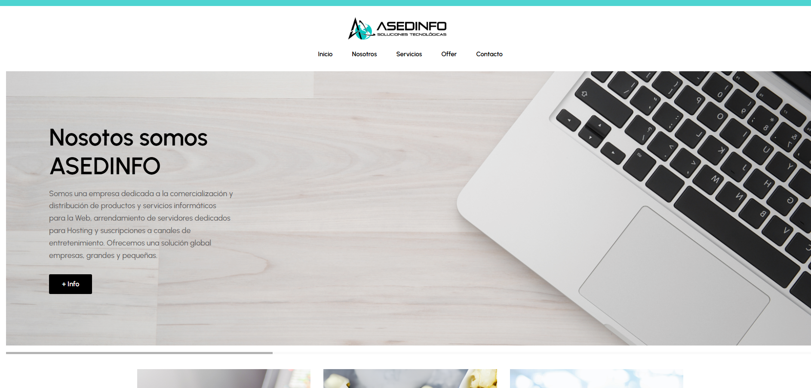

<div align="center">

  <br />
  <br />

  <h2 align="center">Asedinfo</h2>

Tienda de servicios para el desarrollo web, y tambien, <br />Servicios de streaming como Netflix, Youtube Premium.

</div>

<br />

### Demo Screeshots



### Prerequisites

Antes de empezar debes tene los siguientes requerimientos:

- [Git](https://git-scm.com/downloads "Download Git") debe estar instalado en tu sistema operativo

### Run Locally

Para correr **Glowing** de manera local, corre el siguiente comando en tu bash:

Linux and macOS:

```bash
sudo git clone https://github.com/Fuerzas-Armadas-ESPE/002-desarrollo-de-una-aplicaci-n-web-grupo-05.git
```

Windows:

```bash
git clone https://github.com/Fuerzas-Armadas-ESPE/002-desarrollo-de-una-aplicaci-n-web-grupo-05.git
```

### License

Este proyecto fue desarrollado por el grupo 5, conformado por

- [Lindsay Barrionuevo](https://github.com/LindsayBarrionuevo "Lindsay Barrionuevo")
- [Rivera Joel](https://github.com/JoelRiveraL "Rivera Joel")
- [Leonardo Yaranga](https://github.com/LeonardoYaranga "Leonardo Yaranga")
